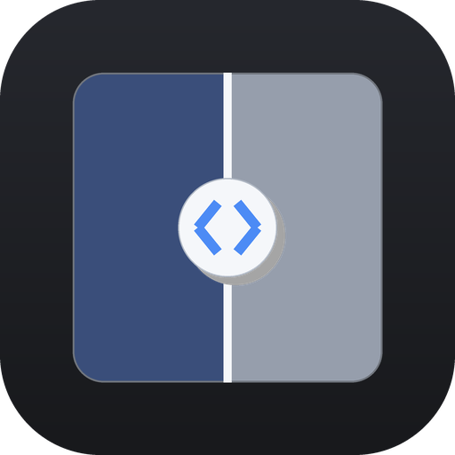

# DiffLens — Aplikasi Pembanding Gambar

<p align="center">
  
</p>

<p align="center">
  
  
  
  
</p>

Aplikasi desktop untuk membandingkan **dua gambar** (misalnya *gambar asli* vs
*gambar hasil edit*) dan melihat perbedaannya secara visual maupun terukur.

Dibuat dengan **Python + PySide6 (Qt6)**, Pillow, NumPy, dan scikit-image.

> Versi saat ini: **1.0.0** · Lihat riwayat perubahan di [CHANGELOG.md](CHANGELOG.md).

---

## Cara Menjalankan

1. Pastikan **Python 3.10+** sudah terpasang dan ada di PATH
   (centang *"Add Python to PATH"* saat instalasi dari python.org).
2. Klik dua kali **`start.bat`**.
3. Saat pertama kali dijalankan, `start.bat` akan otomatis:
   - membuat virtual environment lokal (`.venv`),
   - memasang dependency dari `requirements.txt` (butuh internet, sekali saja),
   - menjalankan aplikasi.

Jalankan berikutnya akan langsung membuka aplikasi tanpa memasang ulang.

> Manual: `pip install -r requirements.txt` lalu `python run.py`.

---

## Fitur

### Mode perbandingan
| Mode | Pintasan | Keterangan |
|------|----------|------------|
| **Slider** | `1` | Garis pembatas digeser: kiri = gambar A (original), kanan = gambar B (hasil edit). |
| **Berdampingan** | `2` | A dan B sejajar, zoom & pan tersinkron. |
| **Kedip** | `3` | Bergantian A↔B otomatis (flicker) untuk melihat perubahan halus. |
| **Overlay** | `4` | B ditumpuk di atas A dengan pengatur opasitas. |
| **Heatmap Diff** | `5` | Peta perbedaan berwarna + penguat (gain) + mode biner. |

### Analisis perbedaan (panel kanan)
- Jumlah & persentase **piksel berubah** (dengan ambang yang bisa diatur)
- **SSIM** (structural similarity), **PSNR**, **MSE**, **RMSE**
- Rata-rata & maksimum selisih, rata-rata per channel (R/G/B)
- Tingkat kemiripan (%)
- **Histogram** selisih
- Perhitungan berjalan di thread terpisah (UI tidak membeku)

### Tampilan
- Zoom (scroll), pan (drag tombol tengah/kanan), Fit (`Ctrl+0`), 1:1 (`Ctrl+1`)
- Latar **checkerboard** untuk area transparan (PNG alpha)
- Samakan ukuran kanvas: ke A / ke B / ke yang terbesar (letterbox, tanpa distorsi)

### Input / Output
- Buka gambar via dialog, **drag & drop** (lepas 1 file = slot A; 2 file = A & B)
- Tukar A ↔ B (`Ctrl+T`)
- Ekspor: **heatmap diff PNG**, **komposit slider PNG**, **komposit berdampingan PNG**, **laporan `.txt`**
- Pengaturan terakhir (folder, bahasa, mode, ukuran jendela) disimpan otomatis

### Lain-lain
- **Dwibahasa Indonesia / English** (menu *Bahasa*)
- Tema gelap
- Status bar: nama, dimensi, mode warna, ukuran file kedua gambar

---

## Pintasan Keyboard

| Pintasan | Fungsi |
|----------|--------|
| `Ctrl+O` | Buka Gambar A (original) |
| `Ctrl+Shift+O` | Buka Gambar B (hasil edit) |
| `Ctrl+T` | Tukar A ↔ B |
| `1` .. `5` | Ganti mode perbandingan |
| `Ctrl+1` | Ukuran asli 1:1 |
| `Ctrl+0` | Sesuaikan jendela |
| `Ctrl++` / `Ctrl+-` | Zoom in / out |
| `←` / `→` | Geser pembatas slider |
| `Space` | Jeda/lanjut kedip (mode Kedip) |
| `Ctrl+Q` | Keluar |

---

## Struktur Proyek

```
pembanding gambar/
├── start.bat            # peluncur: buat venv, install, jalankan
├── run.py               # entry point
├── requirements.txt
├── pyproject.toml       # metadata paket, versi, lisensi, dependency
├── README.md
├── CHANGELOG.md         # riwayat perubahan (Keep a Changelog)
├── LICENSE              # MIT License
├── assets/
│   ├── app_icon.ico     # ikon aplikasi (multi-ukuran)
│   └── app_icon.png     # ikon PNG 512x512
├── tools/
│   └── make_icon.py     # generator ikon (bisa dijalankan ulang)
└── app/
    ├── __init__.py      # SUMBER TUNGGAL versi aplikasi
    ├── main.py          # jendela utama, toolbar, panel, ekspor, drag & drop
    ├── config.py        # konstanta, tema, penyimpanan pengaturan
    ├── i18n.py          # terjemahan ID/EN
    ├── image_utils.py   # memuat & menyiapkan gambar
    ├── diff.py          # perhitungan perbedaan & metrik
    ├── workers.py       # thread untuk komputasi latar
    └── views/
        ├── base.py      # view dasar: zoom, pan, checkerboard
        ├── slider.py    # ★ mode slider (utama)
        ├── sidebyside.py
        ├── blink.py
        ├── overlay.py
        └── diffview.py  # heatmap perbedaan
```

---

## Ikon Aplikasi

Ikon dibuat otomatis (motif **Slider Split** — dua panel gambar dengan
pembatas geser). Untuk membuat ulang ikon setelah mengubah desain:

```
.venv\Scripts\python.exe tools\make_icon.py
```

Menghasilkan `assets/app_icon.png` (512×512) dan `assets/app_icon.ico`
(16/24/32/48/64/128/256 px). Ikon dipakai otomatis oleh jendela aplikasi dan
taskbar Windows.

---

## Lisensi

Proyek ini dilisensikan di bawah **MIT License** — lihat berkas
[LICENSE](LICENSE) untuk teks lengkapnya.

```
MIT License · Copyright (c) 2026 DiffLens contributors
```

---

## Riwayat Versi

Proyek ini mengikuti [Semantic Versioning](https://semver.org/spec/v2.0.0.html)
(`MAJOR.MINOR.PATCH`) dan changelog mengikuti
[Keep a Changelog](https://keepachangelog.com/en/2.0.0/).

- **1.0.0** (2026-10-02) — Rilis publik pertama.
- Lihat selengkapnya di [CHANGELOG.md](CHANGELOG.md).

---

## Catatan

- SSIM memakai **scikit-image** bila terpasang; jika tidak, otomatis memakai
  implementasi cadangan berbasis NumPy.
- Kedua gambar tidak pernah diregangkan/distorsi; bila ukurannya beda, gambar
  disesuaikan dengan skala jaga-rasio (atau bisa dipaksa regang lewat opsi).
- Pengaturan disimpan di `%APPDATA%\DiffLens\settings.json`.
